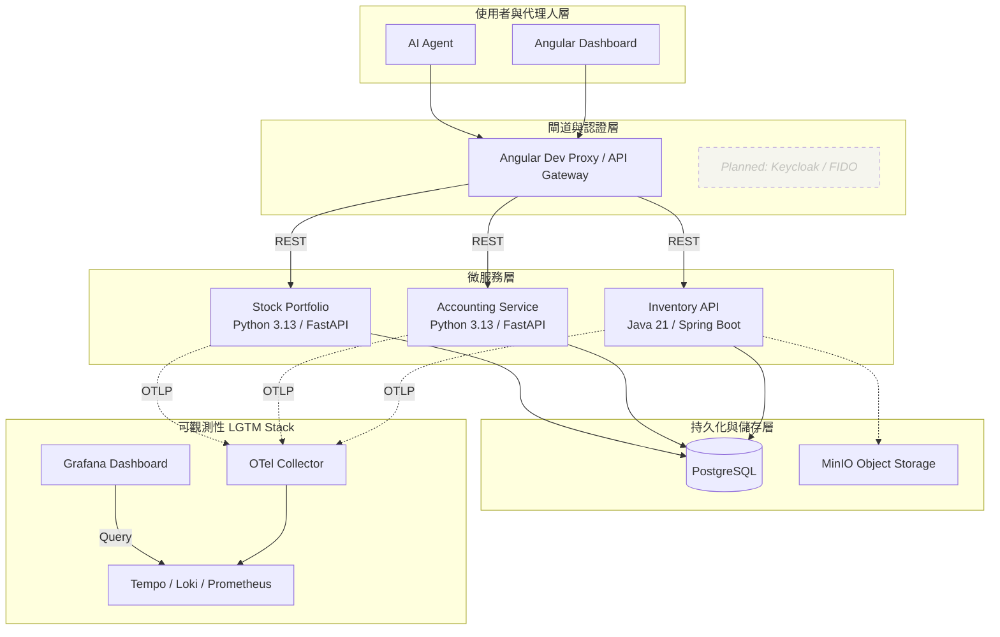

# 🏠 Home Service Hub (家庭服務中樞)

這是一個現代化的 **個人生活運算中樞**。系統從最初的個人工具演進為**由 AI Agent 驅動的自動化後端**。它展示了如何結合 **AI Agent 調用**、**全鏈路可觀測性** 與 **多語言微服務** 來構建一個穩健的家庭自動化系統。

## 🏗 系統架構 (Architecture)

## 🌟 亮點功能 (Features)

- **🤖 AI Agent First**: 服務設計之初即考量 AI Agent的調用需求，具備良好的 API 結構與錯誤回傳機制。
- **全鏈路分散式追蹤 (End-to-End Tracing)**: 從 AI Agent 发起請求到資料庫回應，完整記錄每一毫秒的延遲與日誌。
- **結構化日誌 (Structured Logging)**: Python 服務以 `structlog` 輸出 JSON 日誌，無縫接入 Loki / Grafana。本地開發可切 `LOG_FORMAT=console` 改用人類可讀格式。
- **AI 驅動記帳系統**: 支援自然語言解析，自動將口語化描述轉化為精確的財務交易。
- **智慧庫存與投資**: 整合物件儲存 (MinIO) 管理實體物資，並自動抓取即時台股數據；台股組合支援 CSV 匯入、每日 OHLC 回填、除權息事件抓取、減資/分割自動調整成本基礎，以及當沖標記推導。
- **In-process Scheduler**: 台股組合服務內建 APScheduler，每日 17:00 回補 TWSE/TPEx 收盤、盤中每 15 分鐘刷新報價、15:30 寫入淨值快照。可透過 `SCHEDULER_ENABLED=false` 關閉。

## 🚀 快速開始 (Getting Started)

### 1. 環境準備
- **配置環境變數**: `cp .env.example .env`
- **啟動基礎設施**: `docker compose up -d`

### 2. 啟動服務 (各服務目錄下執行)
- **Inventory**: `./gradlew :item-service:bootRun`
- **Accounting**: `uvicorn app.main:app --port 8000`
- **Stock**: `uvicorn app.main:app --port 8001`
- **Frontend**: `npm start`

### 3. Stock Portfolio 服務環境變數
- `SCHEDULER_ENABLED` (預設 `true`)：設 `false` 停用內建 APScheduler（測試 / CI 必設）。
- `LOG_FORMAT` (預設 `json`)：設 `console` 切換為人類可讀格式。

服務細節（端點清單、Scheduler cron、Day-trade 推導規則等）見 [`services/stock-portfolio-service/README.md`](services/stock-portfolio-service/README.md)。

## 🗺 發展路線 (Roadmap)

### 🟡 Phase 1 & 2: 核心強化與認證 (Active)
- [ ] **身分驗證整合**: 串接 Keycloak 並支援 FIDO2 (WebAuthn) 無密碼登入。
- [ ] **Python 觀測性優化**: 完善 Python 服務的 Trace 欄位與 Context 傳遞。
- [ ] **後端精細化驗證**: 使用 `jakarta.validation` 確保 Java 端數據完整性。
- [ ] **MinIO 完整整合**: 實作圖片上傳、預簽名 URL (Presigned URLs) 與縮圖處理。

### 🟣 Phase 3: 異步架構與微服務解耦 (Planned)
- [ ] **RabbitMQ 整合**: 實作 Domain Events 驅動跨服務協作。
- [ ] **Audit Service**: 建立獨立的審計微服務，非同步記錄系統變動。

### 🔴 Phase 4: 效能優化與邊界安全 (Planned)
- [ ] **Redis Caching**: 為熱門查詢實作快取。
- [ ] **API Gateway & Rate Limiting**: 統一入口並實作流量限制。

---
*Created and maintained as a personal digital life management suite.*

## 📄 授權 (License)

本專案採用 [MIT](LICENSE) 授權。您可以自由使用、修改與分發，但請保留原作者版權聲明。
